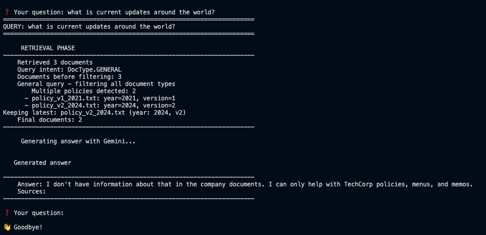

# Policy RAG System 🤖

A Retrieval-Augmented Generation (RAG) system for querying company policies and documents using Google's Gemini API with structured output generation.

## 📋 Table of Contents

- [Overview](#-overview)
- [Model Choice: Why Gemini?](#-model-choice-why-gemini)
- [Features](#-features)
- [Design Decisions](#-design-decisions)
- [Quick Setup](#-quick-setup)
- [Usage](#-usage)
- [Example Outputs](#-example-outputs)
- [Limitations](#-limitations)
- [Technical Architecture](#-technical-architecture)

## 🎯 Overview

This RAG system enables natural language queries over company policy documents, cafeteria menus, and other organizational knowledge. It uses vector similarity search combined with Large Language Model (LLM) generation to provide accurate, source-cited answers.

**Key Capabilities:**
- 📄 Document ingestion with automatic metadata extraction
- 🔍 Semantic search using ChromaDB vector store
- 🎯 Structured output with Pydantic models
- 📚 Source citation and reasoning transparency
- 🔄 Version-aware policy retrieval

## 🚀 Model Choice: Why Gemini?

This project uses **Google Gemini API** (`gemini-2.5-flash`) as the LLM backbone for several strategic reasons:

### 1. **Structured Output Generation** ⭐
Gemini provides native support for JSON schema-based output through `response_json_schema`, enabling precise control over response format:
```python
config = {
    "response_mime_type": "application/json",
    "response_json_schema": PolicyAnswer.model_json_schema(),
    "temperature": 0.3
}
```

This ensures every response conforms to our Pydantic `PolicyAnswer` model with fields like:
- `answer`: The actual response
- `reasoning`: Chain-of-thought explanation
- `cited_sources`: Document references
- `policy_allows_remote`: Boolean policy decisions

### 2. **Cost-Effectiveness for Students** 💰
- Generous free tier with substantial credits for new students
- Significantly more credits for students compared to OpenAI
- Lower per-token pricing for experimentation and development

### 3. **Performance & Quality** ⚡
- Fast response times with `gemini-2.5-flash`
- Strong reasoning capabilities for policy interpretation
- Excellent at following system instructions

### 4. **Ease of Integration** 🛠️
- Simple API with straightforward authentication
- Excellent documentation and examples
- Seamless integration with LangChain

## ✨ Features

- ✅ **Automatic Document Processing**: Extracts metadata (type, version, date) from filenames
- ✅ **Vector Search**: Semantic similarity using ChromaDB + Google Embeddings
- ✅ **Structured Responses**: Guaranteed JSON output format with Pydantic validation
- ✅ **Source Attribution**: Every answer cites specific documents
- ✅ **Version Awareness**: Automatically uses most recent policy versions
- ✅ **CLI Interface**: Interactive and single-query modes
- ✅ **Configurable Output**: Compact or detailed response formats

## 🎨 Design Decisions

### Why No Document Chunking?

This implementation intentionally **does not chunk documents** for the following reasons:

1. **Document Size**: The current knowledge base consists of small documents (~500 characters each)
   - Policy documents: 300-500 characters ( max )
   - Menu documents: ~200 characters
   
2. **Chunking Would Be Counterproductive**: 
   - Standard chunk size (500-1000 chars) would split these documents unnecessarily
   - Smaller chunks (200-300 chars) would fragment coherent information
   - Risk of splitting context that belongs together (e.g., policy conditions and exceptions)

3. **Retrieval Quality**:
   - Whole-document retrieval ensures complete context for short documents
   - No risk of missing related information split across chunks
   - Simpler metadata management (one metadata object per document)

4. **Performance**:
   - Fewer vectors to store and search (3 documents vs. potentially 10-15 chunks)
   - Faster retrieval with smaller vector space
   - Lower embedding costs

**When Chunking Will Be Necessary:**
- Documents exceeding 2000 characters
- Multi-section policy handbooks (10+ pages)
- Technical documentation with distinct topics
- Knowledge base scaling beyond 100 documents

**Future Implementation**: Chunking will be added as an optional, configurable feature when the knowledge base grows or includes longer documents. The implementation will use semantic boundary detection to avoid splitting related content.

## 🚀 Quick Setup

See **[SETUP.md](setup.md)** for detailed installation instructions.

**TL;DR:**
```bash
# 1. Clone repository
git clone <your-repo-url>
cd policy-rag-system

# 2. Create conda environment
conda env create -f environment.yml
conda activate policy_rag

# 3. Set up API key
echo "GEMINI_API_KEY=your_api_key_here" > .env

# 4. Ingest documents
python main.py --ingest

# 5. Ask questions!
python main.py "Can I work from home?"
```

## 💬 Usage

### Single Query Mode
```bash
# Ask a question (compact output - default)
python main.py "Can I work from home?"

# Full detailed output
python main.py "What's on the cafeteria menu?" --full
```

### Interactive Mode
```bash
# Start interactive session
python main.py --interactive

# Interactive with full details
python main.py -i --full
```

### Document Management
```bash
# Ingest/re-ingest all documents
python main.py --ingest
```

### Command Reference
```
Options:
  -h, --help            Show help message
  -q, --question TEXT   Question to ask
  -i, --interactive     Interactive mode
  --ingest              Ingest documents
  -f, --full           Show full detailed output
```

## 📸 Example Outputs

### Query 1: Remote Work Policy
**Question:** "Can I work from home?"




*[Screenshots will be added here after testing]*

## Limitations

### Current Limitations
1. **Document Format**: Only supports `.txt` files (no PDF, DOCX, etc.)
2. **No Deletion Handling**: Deleting documents requires full re-ingestion (`--ingest`)
3. **Single Language**: Optimized for English content only
4. **Local Storage**: Vector store stored locally, not suitable for multi-user scenarios

### Performance Considerations
- **Cold Start**: First query after ingestion may be slower
- **API Rate Limits**: Subject to Google Gemini API quotas

### Known Issues
- Metadata extraction relies on filename patterns (e.g., `policy_v2_2024.txt`)
- ChromaDB persistence directory must be writable

## Technical Architecture

### Component Overview
[](https://mermaid.live/edit#pako:eNqtkmFr2zAQhv-KUD7OyWzLTmwxCokdRiBjhY59mF2KbJ9tEVsyikyahfz3qrZbWgZjsApx3Env-5wkdMG5LABTXDbylNdMafQjTgUyY520jItFd_6Sqc830X6HdkKDKlkO92g-v0GbRLHqAUTFBbzIvqu8hqNWTHMp0J6dQd2PuM3giZKoVrJl8WaQ_4RcS4XuTIB3ujjhojIgQ3noeAeN6TE4Ypn3LQiNbpXM4Xg0sskYDcZt8hVaLjha3-4Gw37_DX1C2zaDYhLGo3AsxnjU5wbQGpW8aejMYSsCgWWuIQ9AZ7ZtT_n8xAtdU9I9WrlspKKzsiytUgo9PwGvak0z2RRvkZsJWWZZbnv_hHze-xsympAhIR4sP-SU8ccjtxOSeCzwyX8ix2j-wOFugBdQsr7R6IVKCPmDii1cKV5gWrLmCBZuQZn_bGp8ecalWNfQQoqpSQumDilOxdWYOiZ-SdliqlVvbEr2Vf0K6buCaYg5qxRrX1cViAJUJHuhMfXCgYHpBT9i6obOgtgr3w592zXTwmdMfW8Ren4QOsHSdVYr8-hXC_8emtqLgCxtx1m6vm8HgRuG1ycsbyur)

### Data Flow

1. **Ingestion Phase** (Current - Optimized for Small Documents):
```
   .txt files (~500 chars) → Metadata Extraction → Whole Document Embedding → ChromaDB
```
   
   **Rationale**: Documents are small enough to fit entirely within embedding context limits and provide complete semantic meaning without chunking.

2. **Query Phase**:
```
   User Query → Embedding → Vector Search → Document Retrieval → 
   LLM Generation (with JSON schema) → Pydantic Validation → Response
```

**Current Stats**:
- Average document size: ~450 characters
- Vector store size: 3 documents
- Retrieval time: <100ms
- Context preservation: 100% (no information loss from chunking)

### Key Technologies
- **LangChain**: RAG orchestration framework
- **ChromaDB**: Vector database for semantic search
- **Google Gemini**: LLM for generation + embeddings
- **Pydantic**: Data validation and structured outputs
- **PyYAML**: Configuration management
